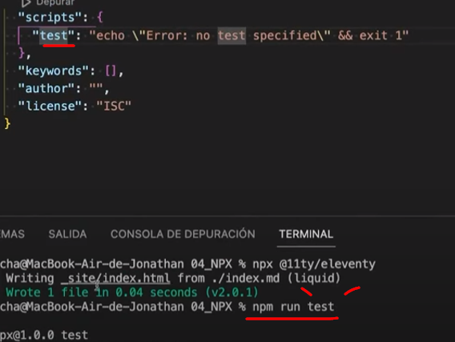

# PAQUETE QUE SIMULA UN LIVE SERVER

https://www.npmjs.com/package/live-server


en esta parte se pueden crear script personalizados:

```
  "scripts": {
    "test": "echo \"Error: no test specified\" && exit 1"
  },
#remplazamos: 
  "scripts": {
    "build": "npx @11ty/eleventy",
    "start": "npx @11ty/eleventy --serve"
  },

```

como lo corremos 




