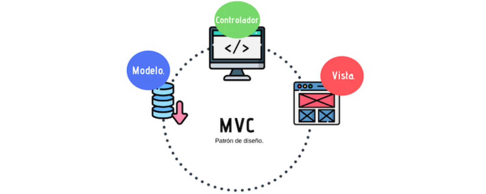
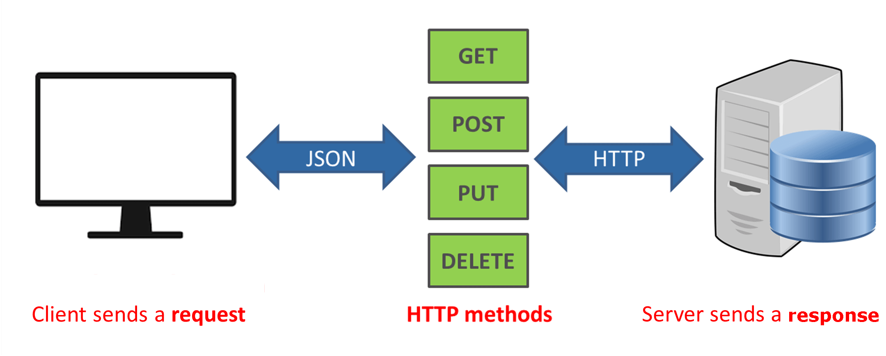
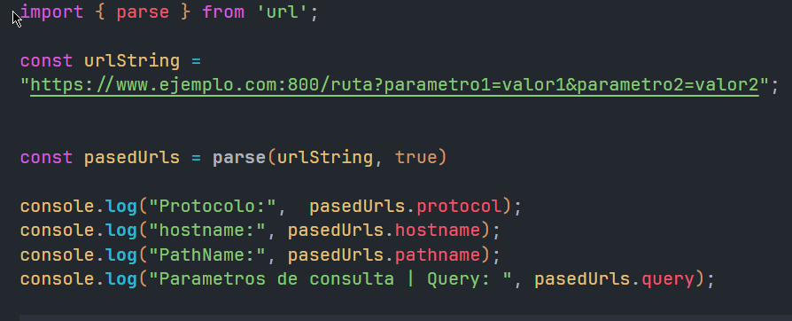
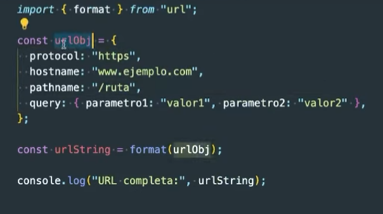
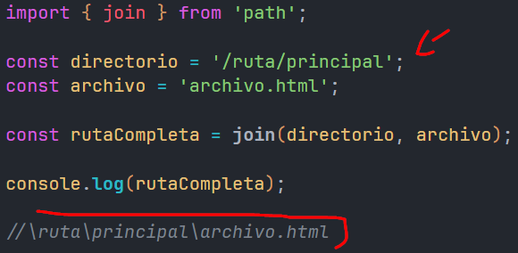
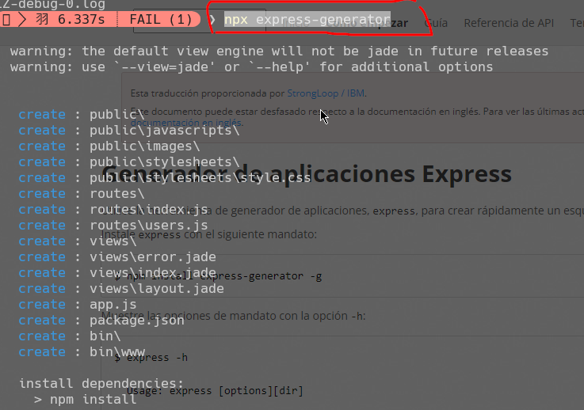

# Curso de nodejs y exprees 

Patron MVC


EN EL BACKEND hay una variedad de opciones. 

depente del hostin y atrabajar y el bakend que vamos hacer

* El rey del bakend siguen siendo el rey del bakend


* Arquitecturas <b> 1:MVC </b>  | <b>2:API_REST </b>

MVC: 

API_REST: 


* Codigos de respuesta:

Url de mozila: https://developer.mozilla.org/es/docs/Web/HTTP/Status


* Asi es la estructura de las url:


Cuando lo ejecutamos sale: 
```
Protocolo: https:
hostname: www.ejemplo.com
PathName: /ruta
Parametros de consulta | Query: 
 [Object: null prototype] 
 { parametro1: 'valor1', parametro2: 'valor2' }
```

* Con objeto es simplemente otra forma de hacerlo: 


modulo: https://nodejs.org/api/url.html

* join une las ritas 
* path nos encuentra la rita


* para crear una extrecutura basica de archivos 
